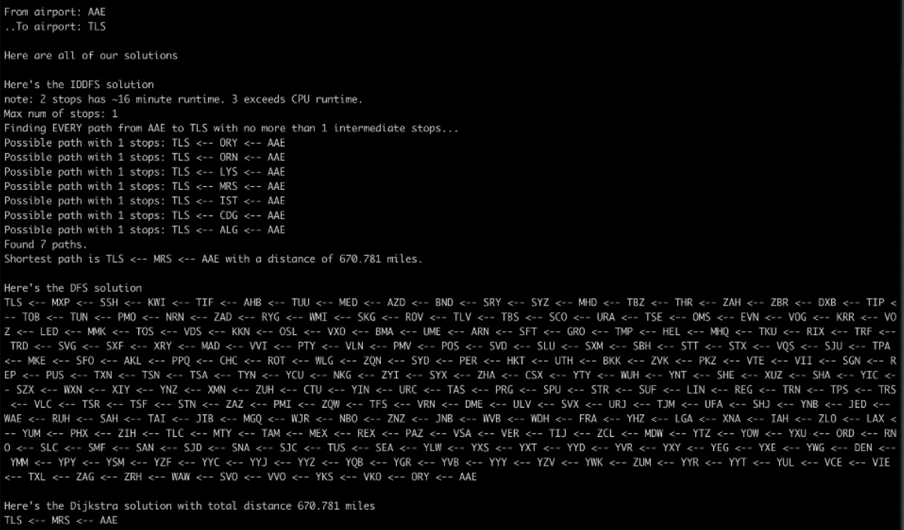

# CS 225 Final Project

### Group:

* Zhenyu Wang
* Minwoo Cho
* Daniel Lopez
* Daniel Ahn

### This Project:

This repository is our submission for the University of Illinois at Urbana-Champaign CS 225 final project. Our project uses the Open Flights dataset to pursue the goal of determining the shortest flight between two airports. As per the final project requirements, this code implements DFS for graph traversal as well as IDDFS and Dijkstra's Algorithm for finding the shortest path between nodes. 

Click me &darr;

[](https://www.youtube.com/watch?v=J0u2yzH9kK0)

## Location of Code, Data, Results

All relevant code and data is located in the Graph folder. Our test cases are implemented in the myTest subfolder. 

To find the dataset we used, visit the [Open Flights](https://openflights.org/data.html) website.

### Example output




## How to Build and Run

To download this program, use this command in your terminal:

````
git clone https://github-dev.cs.illinois.edu/cs225-sp21/minwooc2-zhenyuw5-dl14-dka3 (not working anymore)
                                            |
                                            V
https://github.com/ZhenyuWang-uiuc/Projects/tree/main/Path%20finder%20-%20CS%20225%20final%20Project (try this)
````

Then, open the newly created folder named "minwooc2-zhenyuw5-dl14-dka3" and then open the folder named "Graph".

To compile, type:

```
$ make
```
### To run the program, you can type:
---
#### To view the DFS solution: 
```
$ ./Graph DFS
```
---
#### To view the IDDFS solution:
```
$ ./Graph IDDFS
```
---
#### To view the Dijkstra's Algorithm solution:

```
$ ./Graph DIJ
```
---
#### To view all solutions:
```
$ ./Graph all
```
---
#### Note: If you have your routes.dat and it has the same format as the one provides from "Open Flights". Then you need to update your routes and the tutorial is in the folder "updateRoutes".
---

Then, you will be greeted with a prompt asking from which airport to which airport, where you simply enter the 3 letter airport identifier in the entry box. 

You may be requested to enter the maximum number of stops - please limit this to 2 stops as 3 would exceed the CPU runtime.

Then, the program will output its requested solution.

## Test Cases

To build test and run test cases, type:
```
$ make test
$ ./test
```
For our project, we implemented various test cases, including:

* Testing graph completeness
  * Edge cases, such as disconnected graphs
* Dijkstra’s Algorithm
  * Creating miniature graphs and making sure the algorithm gives an intended result
* IDDFS
  * Tested by running algorithm on smaller graphs and the full data and checking answers by hand. Further tested by confirming the final output to be the same as the Dijkstra’s Algorithm.
* DFS
  * DFS was used to build the graph: passing the graph completeness guaranteed that the DFS algorithm works

